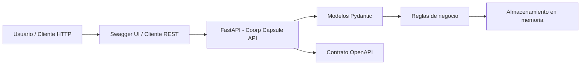
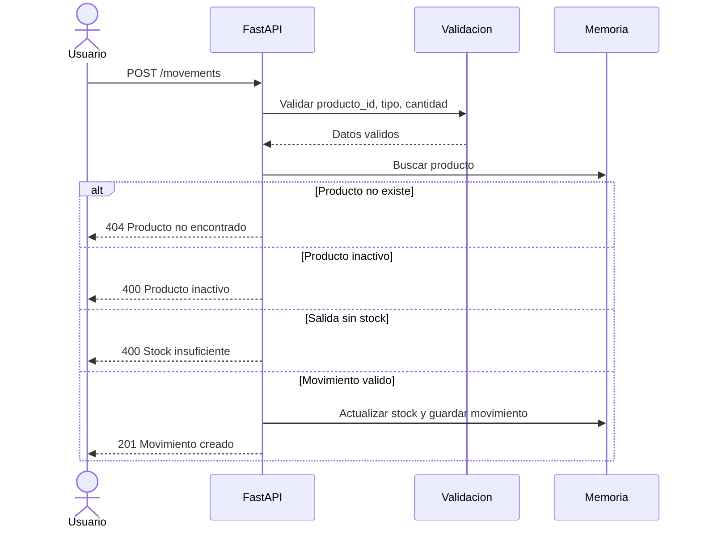

# Architecture - Coorp Capsule API

## Resumen

Coorp Capsule API usa una arquitectura modular simple para el MVP. La aplicacion expone endpoints HTTP con FastAPI, valida entradas con Pydantic y mantiene el estado temporal en memoria. Esta decision permite demostrar el flujo principal de negocio sin agregar complejidad de infraestructura antes de validar el MVP.

## Bloques principales

| Bloque | Responsabilidad |
|---|---|
| Cliente HTTP | Consume la API desde Swagger, curl, Postman u otra herramienta |
| FastAPI app | Publica endpoints, aplica reglas de negocio y retorna respuestas HTTP |
| Modelos Pydantic | Validan request bodies y definen respuestas |
| Servicio de inventario | Gestiona productos, estados y movimientos |
| Almacenamiento en memoria | Guarda productos y movimientos durante la ejecucion local |
| OpenAPI | Documenta contrato, requests, responses y errores |

## Diagrama Mermaid

## Flujo de movimiento de inventario

## Decision arquitectonica

### Decision

Usar FastAPI con almacenamiento temporal en memoria.

### Justificacion

FastAPI permite construir una API funcional de forma rapida, validar entradas con Pydantic y generar documentacion interactiva en Swagger. Para el MVP, el almacenamiento en memoria es suficiente porque el objetivo de la tarea es demostrar el contrato de API y el flujo principal de negocio, no operar datos productivos.

### Consecuencia

La API es facil de ejecutar localmente y permite probar el flujo completo. La limitacion es que los datos se pierden al reiniciar el servidor. En una siguiente iteracion, el almacenamiento en memoria se reemplazaria por PostgreSQL o SQLite.

## Evolucion propuesta

- Agregar persistencia con base de datos.
- Separar rutas, modelos y servicios en modulos.
- Agregar autenticacion basica.
- Agregar pruebas automatizadas de reglas de negocio.
- Publicar tablero del backlog en GitHub Projects.
