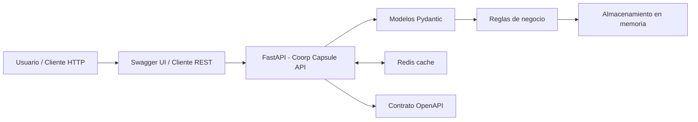
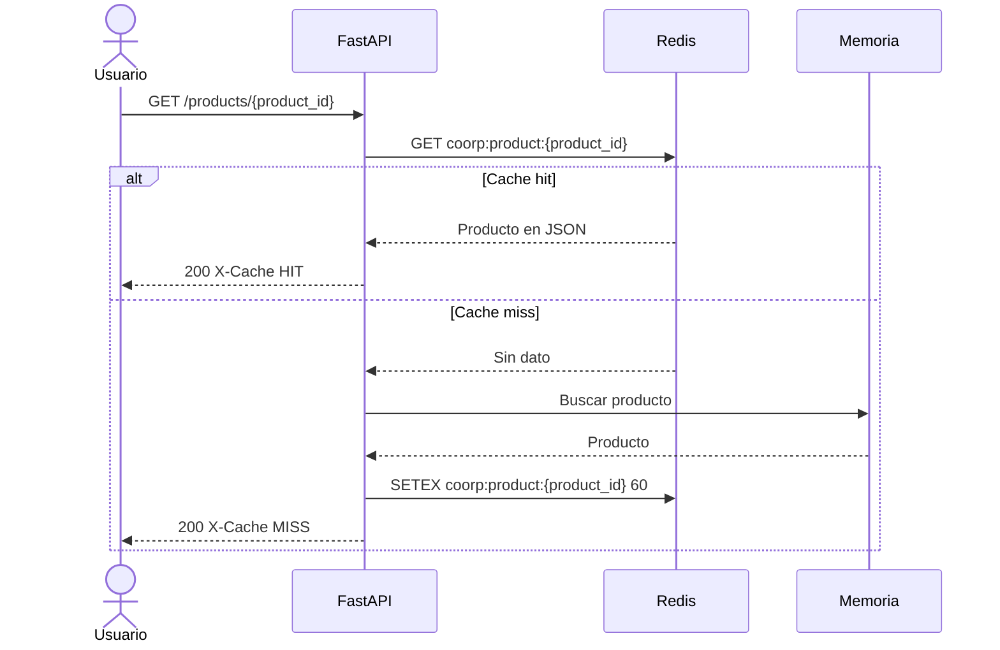
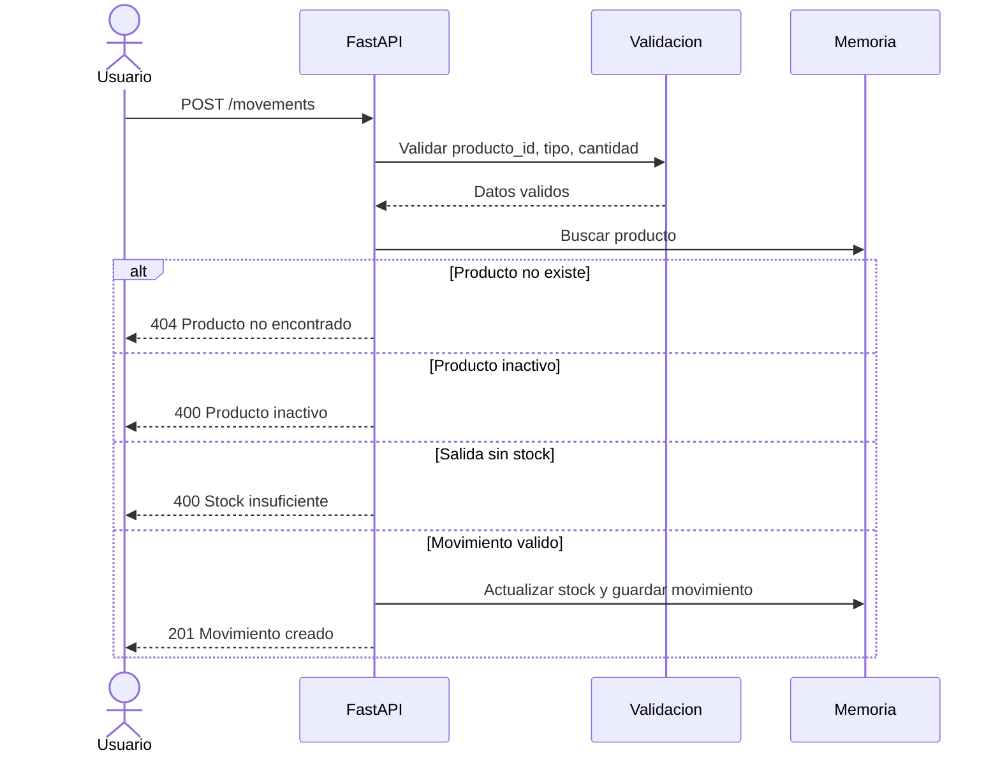

# Architecture - Coorp Capsule API

## Resumen

Coorp Capsule API usa una arquitectura modular simple para el MVP. La aplicacion expone endpoints HTTP con FastAPI, valida entradas con Pydantic, mantiene el estado temporal en memoria y usa Redis como cache para acelerar consultas repetidas de productos. Docker Compose levanta la API y Redis como servicios separados.

## Bloques principales

| Bloque | Responsabilidad |
|---|---|
| Cliente HTTP | Consume la API desde Swagger, curl, Postman u otra herramienta |
| FastAPI app | Publica endpoints, aplica reglas de negocio y retorna respuestas HTTP |
| Modelos Pydantic | Validan request bodies y definen respuestas |
| Servicio de inventario | Gestiona productos, estados y movimientos |
| Almacenamiento en memoria | Guarda productos y movimientos durante la ejecucion local |
| Redis | Guarda respuestas cacheadas de productos con TTL |
| Docker Compose | Orquesta el contenedor de la API y el contenedor de Redis |
| OpenAPI | Documenta contrato, requests, responses y errores |

## Diagrama Mermaid

## Flujo de cache Redis

## Flujo de movimiento de inventario

## Decision arquitectonica

### Decision

Usar FastAPI con almacenamiento temporal en memoria y Redis como cache-aside para consultas de producto.

### Justificacion

FastAPI permite construir una API funcional de forma rapida, validar entradas con Pydantic y generar documentacion interactiva en Swagger. Redis se agrega porque `GET /products/{product_id}` puede repetirse muchas veces en operaciones de inventario y es un buen candidato para cache. El TTL evita datos guardados indefinidamente y la API invalida la clave cuando cambia el producto o su stock.

### Consecuencia

La API es facil de ejecutar localmente con `docker compose up --build` y permite demostrar cache hit/cache miss. La limitacion principal es que los datos base siguen en memoria y se pierden al reiniciar el servidor. En una siguiente iteracion, el almacenamiento en memoria se reemplazaria por PostgreSQL o SQLite.

## Evolucion propuesta

- Agregar persistencia con base de datos.
- Separar rutas, modelos y servicios en modulos.
- Agregar autenticacion basica.
- Agregar pruebas automatizadas de reglas de negocio.
- Publicar tablero del backlog en GitHub Projects.
