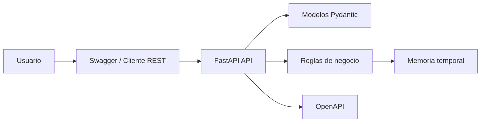

# Coorp Capsule API - Entrega MVP

## Nombre del sistema

Coorp Capsule API.

## Problema que resuelve

El sistema resuelve la falta de trazabilidad en inventarios basicos donde los productos y movimientos de stock se registran manualmente. El MVP permite crear productos, consultar inventario, cambiar estado y registrar entradas o salidas con validacion.

## Scope / No-scope

Scope: crear productos, consultar productos, actualizar datos, activar o desactivar productos, registrar entradas y salidas, validar stock y consultar movimientos.

No-scope: autenticacion real, base de datos persistente, interfaz web, reportes avanzados, multiples bodegas e integraciones externas.

## Links

- Repositorio GitHub: https://github.com/Ferotuc/coorp-capsule-api
- Video Google Drive: PENDIENTE - pegar aqui el enlace publico con permiso de lectura.
- Backlog / tablero web: PENDIENTE - pegar aqui el enlace del GitHub Project, Trello, Jira o ClickUp.

## Resumen de arquitectura

La API esta construida con FastAPI. Los modelos Pydantic validan los datos de entrada y salida. Las reglas de negocio se aplican en los endpoints de productos y movimientos. Para el MVP, los productos y movimientos se guardan temporalmente en memoria. La documentacion del contrato se mantiene en `docs/api/openapi.yaml` y tambien puede revisarse en Swagger UI al ejecutar la API.

## Endpoints implementados

| Metodo | Endpoint | Funcion |
|---|---|---|
| GET | `/health` | Verificar disponibilidad |
| POST | `/products` | Crear producto |
| GET | `/products` | Listar productos |
| GET | `/products/{product_id}` | Consultar producto |
| PUT | `/products/{product_id}` | Actualizar producto |
| PATCH | `/products/{product_id}/status` | Cambiar estado |
| POST | `/movements` | Registrar entrada o salida |
| GET | `/products/{product_id}/movements` | Consultar movimientos |

## Decision tecnica importante

Se uso almacenamiento en memoria para el MVP. Esta decision reduce complejidad y permite demostrar el flujo principal de negocio rapidamente. La consecuencia es que los datos se pierden al reiniciar el servidor; en una siguiente iteracion se reemplazaria por SQLite o PostgreSQL.
