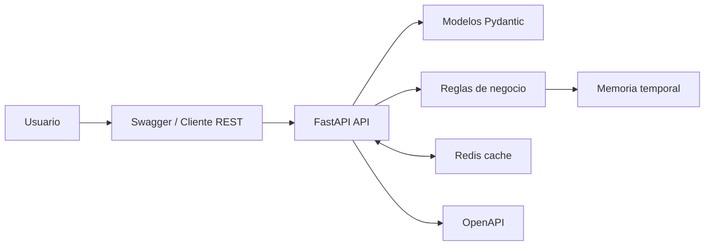

# Coorp Capsule API - API MVP + Cache Redis en Docker

## Nombre del sistema

Coorp Capsule API.

## Problema que resuelve

El sistema resuelve la falta de trazabilidad en inventarios basicos donde los productos y movimientos de stock se registran manualmente. El MVP permite crear productos, consultar inventario, cambiar estado y registrar entradas o salidas con validacion. En esta entrega se agrego cache Redis para mejorar consultas repetidas de productos.

## Scope / No-scope

Scope: crear productos, consultar productos, actualizar datos, activar o desactivar productos, registrar entradas y salidas, validar stock, consultar movimientos, levantar API + Redis con Docker Compose y cachear consultas de producto.

No-scope: autenticacion real, base de datos persistente, interfaz web, reportes avanzados, multiples bodegas e integraciones externas.

## Links

- Repositorio GitHub: https://github.com/Ferotuc/coorp-capsule-api
- Video Google Drive: PENDIENTE - pegar aqui el enlace publico con permiso de lectura antes de entregar.
- Backlog / tablero web: PENDIENTE - pegar aqui el enlace del GitHub Project, Trello, Jira o ClickUp antes de entregar.

## Resumen de arquitectura

La API esta construida con FastAPI. Los modelos Pydantic validan los datos de entrada y salida. Las reglas de negocio se aplican en los endpoints de productos y movimientos. Para el MVP, los productos y movimientos se guardan temporalmente en memoria. Redis entra como cache para `GET /products/{product_id}` y Docker Compose levanta la API y Redis con un solo comando.



## Endpoint cacheado

El endpoint cacheado es `GET /products/{product_id}`.

Funcionamiento:

- Cache key: `coorp:product:{product_id}`.
- Dato guardado: JSON del producto con id, codigo, nombre, precio, activo y stock.
- TTL: 60 segundos.
- Estrategia: cache-aside.
- Cache miss: la API consulta memoria, guarda en Redis con `SETEX` y responde `X-Cache: MISS`.
- Cache hit: la API responde desde Redis y retorna `X-Cache: HIT`.

Se eligio este endpoint porque la consulta individual de producto suele repetirse muchas veces mientras el inventario se revisa o se registra movimiento.

## Endpoints implementados

| Metodo | Endpoint | Funcion |
|---|---|---|
| GET | `/health` | Verificar disponibilidad |
| POST | `/products` | Crear producto |
| GET | `/products` | Listar productos |
| GET | `/products/{product_id}` | Consultar producto con cache Redis |
| PUT | `/products/{product_id}` | Actualizar producto |
| PATCH | `/products/{product_id}/status` | Cambiar estado |
| POST | `/movements` | Registrar entrada o salida |
| GET | `/products/{product_id}/movements` | Consultar movimientos |

## Comandos basicos

```bash
docker compose up --build
```

```bash
curl -X POST http://127.0.0.1:8000/products -H "Content-Type: application/json" -d "{\"codigo\":\"CAP-001\",\"nombre\":\"Capsula Ejecutiva\",\"precio\":125.50,\"activo\":true}"
curl -i http://127.0.0.1:8000/products/1
curl -i http://127.0.0.1:8000/products/1
```

```bash
docker compose ps
docker compose exec redis redis-cli TTL coorp:product:1
```

## Decision tecnica importante

Se uso Redis como cache principal porque permite demostrar una mejora tecnica real sin cambiar todavia la persistencia del MVP. La consecuencia es que la consulta repetida puede responder desde cache, pero la fuente principal sigue siendo memoria; en una siguiente iteracion se reemplazaria por PostgreSQL.
